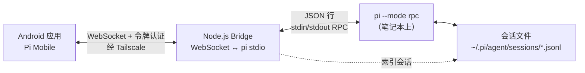

# PiPilot（领航 Pi）

> **把你的 Pi 编程智能体装进口袋。**
> 通过 Tailscale 在 Android 上随时随地运行和操控编程会话。

[English](./README.en.md) | 简体中文

PiPilot（领航 Pi）是 [Pi 编程智能体](https://github.com/badlogic/pi-mono)的 Android 客户端，让你在离开笔记本时也能实时掌控会话。

## 演示（施工中）

▶️ **在线演示：** https://streamable.com/jngtjp *（施工中）*

## 截图

| 聊天 + 工具 | 会话 + 控制 |
|---|---|
|  |  |

## 它能做什么

Pi 运行在你的笔记本上，这个应用让你可以：

- 随时随地浏览并恢复编程会话
- 与智能体对话：发送提示、中止、调整方向（steer）、追加消息（follow-up）、压缩上下文、重命名、复制最新回复、导出、导入 JSONL 会话
- 通过应用内命令面板发现斜杠命令（`/tree`、`/stats`、`/model`、`/new`、`/name`、`/copy`、`/import` 等）
- 查看流式思考/工具输出块，支持折叠/展开
- 打开内置 bash 对话框（运行/中止/历史/复制输出）
- 查看会话统计与上下文占用，并通过高级模型选择器切换模型
- 检测跨设备会话漂移，一键 **立即同步** 安全刷新
- 为提示附加图片
- 在会话树分支间原位导航（跳转+继续）、筛选树视图、从所选条目分叉
- 通过经过认证的持久化不透明链接共享会话；复制、撤销、重新生成链接，且不暴露 Pi 会话 ID
- 在不同项目（不同工作目录）之间切换
- 处理扩展对话框/小组件/状态更新（confirm/input/select/editor/setStatus/setWidget）

连接走 Tailscale，无需端口转发即可在任何网络下使用。

## 总体设计



Bridge 是一个小型 Node.js 服务，负责在 WebSocket 与 pi 的 stdin/stdout JSON 协议之间转译。应用连接的是 Bridge，而不是直接连接 pi。更详细的架构图见 [docs/architecture.md](docs/architecture.md)。

## 文档

- [产品路线图](docs/roadmap.md)
- [文档索引](docs/README.md)
- [架构图（Mermaid）](docs/architecture.md)
- [架构决策记录（ADR）](docs/adr/README.md)
- [代码库导读](docs/codebase.md)
- [自定义扩展](docs/extensions.md)
- [Bridge 协议参考](docs/bridge-protocol.md)
- [测试指南](docs/testing.md)
- [引导与故障恢复](docs/onboarding.md)

> 说明：`docs/ai/` 存放开发过程中的规划/进度产物；面向用户与维护者的文档位于上述顶层 `docs/` 文件中。目前 `docs/` 下的文档仍为英文。

## 环境搭建

### 1. 笔记本端

如果尚未安装 pi：

```bash
npm install -g @earendil-works/pi-coding-agent@^0.80.6
pi --version # 最低且经过测试的版本：0.80.6
```

克隆仓库并启动 Bridge：

```bash
git clone https://github.com/GuoZhenKuang/pipilot.git
cd pipilot/bridge
pnpm install
# 创建 .env 并设置 BRIDGE_AUTH_TOKEN（见下方「配置」一节）
pnpm start
# 在另一个终端中，当 BRIDGE_ENABLE_HEALTH_ENDPOINT=true 时：
curl --fail http://127.0.0.1:8787/health
```

Bridge 默认绑定 `127.0.0.1:8787`。将 `BRIDGE_HOST` 设为笔记本的 Tailscale IP 即可允许手机访问（除非有防火墙限制，否则避免使用 `0.0.0.0`）。Bridge 会按工作目录按需拉起 pi 进程。设置 `BRIDGE_STATE_DIR` 用于仅所有者可见的持久化共享引用；可选设置 `BRIDGE_SHARE_ORIGIN` 用于无元数据的自托管落地页 URL。绝不要把令牌或 Pi 会话元数据放进链接。

### 2. 手机端

安装 APK 或从源码构建：

> 本项目基于 [ayagmar/pi-mobile](https://github.com/ayagmar/pi-mobile) 早期版本发展而来，现由 GuoZhenKuang 独立维护与发布。

> 本项目基于 [ayagmar/pi-mobile](https://github.com/ayagmar/pi-mobile) 早期版本发展而来，现由 GuoZhenKuang 独立维护与发布。

```bash
./gradlew :app:assembleDebug
adb install app/build/outputs/apk/debug/app-debug.apk
```

### 3. 连接

1. 配置好 Bridge 后，打印配对码：

   ```bash
   cd bridge
   pnpm pair
   ```

2. 在 Pi Mobile 中打开 **主机**，点击 **扫码配对**，扫描终端上的二维码，核对自动填充的连接信息并保存。二维码使用既有的 `BRIDGE_AUTH_TOKEN`，请妥善保管。若自动发现 Tailscale 主机名不可用，可运行 `pnpm pair -- --host <可达主机名>`。

3. 也可以手动填写：
   - 主机：笔记本的 Tailscale MagicDNS 主机名（`<设备>.<tailnet>.ts.net`）
   - 端口：`8787`（或 Bridge 实际使用的端口）
   - 使用 TLS：本地/Tailscale 场景下保持关闭，除非你在前面加了 TLS
   - 令牌：在 `bridge/.env` 中设置为 `BRIDGE_AUTH_TOKEN`；已保存的令牌不会显示

4. 使用连接测试来区分网络、认证和 Pi 就绪三类故障。应用会从 `~/.pi/agent/sessions/`（或 `BRIDGE_SESSION_DIR` 指定的目录）读取会话。

5. 点击会话即可恢复。

## 工作原理

### 会话

「会话」页是一个跨主机的缓存优先控制台。它组织活动、置顶、最近以及可显式恢复的隐藏会话；只搜索隐私安全的标签/预览/模型元数据；普通卡片上从不显示完整 cwd 或会话文件路径。置顶与隐藏状态只在本地保存 `SessionKey(hostProfileId, sessionId)` 值和展示密度。跨主机刷新一次最多处理两台主机，且一台主机失败不会隐藏另一台主机的缓存结果。

纯文本快捷回复复用经过认证的会话控制器与既有的控制锁。空闲目标会先恢复再投递；活动目标只能选择追加消息或调整方向；绝不会在未经确认的情况下静默切换走另一个正在运行的任务。

### 进程管理

Bridge 为每个 cwd 管理一个 pi 进程：

- 首次连接某项目时拉起 pi（附带用于树导航和移动端工作流命令的内部扩展）
- 进程保持存活，直到空闲超时（`BRIDGE_PROCESS_IDLE_TTL_MS`）
- 短暂断连在重连宽限期内保留控制锁（`BRIDGE_RECONNECT_GRACE_MS`）
- 重连复用既有进程
- 崩溃后按指数退避重启

### 消息流

```
用户输入提示词
    ↓
应用发送 WebSocket → Bridge
    ↓
Bridge 写入 pi stdin（JSON 行）
    ↓
pi 处理并将事件写到 stdout
    ↓
Bridge 转发事件 → 应用
    ↓
应用渲染流式文本/工具输出
```

## 聊天体验亮点

- **以轮次为中心的对话**：每条提示把其助手活动与最终回答组织为一个完整轮次。
- **安静的思考展示**：推理内容默认折叠且低强调，除非主动展开。
- **紧凑的工具活动**：完成的工具折叠为按工具定制的摘要；参数、输出和差异仍可按需查看。
- **编辑差异查看器**：`edit` 工具调用显示修改前后的内容。
- **命令面板**：在输入框菜单中快速插入斜杠命令，包括由 Bridge 支持的移动端命令。
- **稳定的运行中输入区**：运行过程中直接在输入框继续打字，草稿可作为追加消息或调整方向投递，无需单独对话框。
- **阅读位置控制**：展开详情会暂停自动滚动，加载更早的轮次会保持位置，「N 条新消息」只在你选择时才回到实时内容。
- **图片预览**：附加图片从本地 Android URI 或远端 Pi 会话中记录的图片数据渲染，支持全屏预览。
- **快捷复制**：在消息内复制助手回答，或从会话详情复制最新回复。
- **Bash 对话框**：执行 shell 命令，带超时/截断处理和历史记录。
- **聊天中的会话状态**：显示当前会话名称与来自 pi 状态的排队消息数。
- **会话浏览器中的会话名称**：已命名活动会话在会话页头部、重命名对话框和卡片中更醒目。
- **会话详情与交接面板**：统计、路径、次要操作、安全的交接摘要、最新回复复制与导出。
- **模型选择器**：按提供商分组、可搜索的模型选择。
- **树导航器**：查看分支点、筛选视图、原位跳转，或从所选条目分叉。
- **会话一致性防护**：例行的刷新保持安静；显式的他端冲突与重载失败保持可操作。
- **设置项**：自动压缩、自动重试、调整方向/追加消息投递模式、主题与状态条可见性。

## 故障排查

### 无法连接

1. 确认两台设备都在运行 Tailscale
2. 确认 Bridge 正在运行：`curl http://100.x.x.x:8787/health`（仅在 `BRIDGE_ENABLE_HEALTH_ENDPOINT=true` 时）
3. 核对令牌与 `BRIDGE_AUTH_TOKEN` 完全一致
4. 优先使用笔记本的 MagicDNS 主机名（`*.ts.net`），而不是裸 IP

### 会话不显示

1. 确认笔记本上存在 `~/.pi/agent/sessions/`
2. 确认 Bridge 对该目录有读取权限
3. 查看 Bridge 日志中的报错

### 流式输出卡顿

1. 在 logcat 中查看 `PerfMetrics` 的实际耗时数据
2. 留意 `FrameMetrics` 的掉帧告警
3. 确认 Wi-Fi/蜂窝连接稳定
4. 尽量靠近笔记本（同一房间）

### 恢复会话时应用崩溃

1. 在 logcat 中查看内存溢出报错
2. 超大的会话历史可能引发问题
3. 先压缩会话：在 pi 中执行 `/compact`，然后恢复

## 开发

### 项目结构

```
app/              - Android 应用（Compose UI、ViewModel）
core-rpc/         - RPC 协议模型与解析
core-net/         - WebSocket 传输与连接管理
core-sessions/    - 会话缓存与仓库
bridge/           - Node.js Bridge 服务
benchmark/        - Macrobenchmark / 基线性能档案脚手架
```

### 运行测试

构建使用 JDK 25，detekt 稳定 CLI 使用 JDK 21 工具链，另需 Android SDK platform 37.0 / build-tools 37.0.0、Node 24 LTS+、pnpm 10。详见[依赖矩阵](docs/dependency-matrix.md)。

```bash
# Android 测试
./gradlew test

# Bridge 测试
cd bridge && pnpm test

# Bridge 完整检查（lint + 类型检查 + 测试）
cd bridge && pnpm run check

# 完整的非设备 Android 门禁
./gradlew clean ktlintCheck detekt test :benchmark:compileBenchmarkKotlin :app:lintDebug :app:assembleDebug :app:assembleRelease
./gradlew :app:compileDebugAndroidTestKotlin
```

### 值得关注的日志

```bash
# 性能指标
adb logcat | grep "PerfMetrics"

# 流式过程中的掉帧
adb logcat | grep "FrameMetrics"

# 应用常规日志
adb logcat | grep "PiMobile"

# Bridge 日志（笔记本上）
pnpm start 2>&1 | tee bridge.log
```

## 配置

### Bridge 环境变量

创建 `bridge/.env`：

```env
BRIDGE_HOST=0.0.0.0                 # 绑定地址（默认：127.0.0.1）
BRIDGE_PORT=8787                    # 监听端口
BRIDGE_AUTH_TOKEN=your-secret       # 必需的认证令牌
BRIDGE_PROCESS_IDLE_TTL_MS=300000   # 空闲进程回收窗口（毫秒）
BRIDGE_RECONNECT_GRACE_MS=30000     # 断连后保留控制锁的时长（毫秒）
BRIDGE_SESSION_DIR=/absolute/path/to/.pi/agent/sessions  # 覆盖用于索引和拉起 pi 运行时的会话目录
BRIDGE_LOG_LEVEL=info               # fatal,error,warn,info,debug,trace,silent
BRIDGE_ENABLE_HEALTH_ENDPOINT=true  # 设为 false 可禁用 /health 端点
BRIDGE_WEBSOCKET_MAX_PAYLOAD_BYTES=16777216 # WebSocket 单条消息上限（16 MiB）
BRIDGE_IMPORT_MAX_BYTES=10485760     # UTF-8 JSONL 导入大小上限（10 MiB）
BRIDGE_PI_COMMAND=pi                 # Pi 可执行文件路径/名称；启动时会用 --version 探测
```

### 应用构建变体

Debug 构建包含开发日志与断言。仓库安全的 release 构建为未签名/默认配置，当前未启用压缩混淆；分发前请阅读 [`docs/release.md`](docs/release.md)。

## 安全说明

- 必须使用令牌认证 —— 不要在无令牌的情况下暴露 Bridge
- Bridge 中的令牌比较经过加固（常量时间哈希比较）
- Bridge 默认只绑定 localhost；如需远程访问，请显式把 `BRIDGE_HOST` 设为你的 Tailscale IP
- 避免使用 `0.0.0.0`，除非你有意把服务置于严格的防火墙/Tailscale 策略之后
- `/health` 的暴露由 `BRIDGE_ENABLE_HEALTH_ENDPOINT` 显式控制（最小暴露原则下应关闭）
- Android 明文流量范围仅限 `localhost` 与 Tailnet MagicDNS 主机（`*.ts.net`）
- 全部流量走 Tailscale 加密网络
- 会话数据始终留在笔记本上，应用只负责显示

## 局限

- 无离线模式 —— 需要与笔记本保持实时连接
- 活动历史优先使用基于游标的 `get_entries` 投影，必要时回退到有文档记载的 `get_messages`；界面渲染的是有上限的窗口，而非真正的服务端分页
- 会话树展示有缓存并按代次门控，但导航仍依赖内部 `pi-mobile-tree` 扩展，因为 Pi 0.80.6 没有导航类 RPC 命令
- 移动端键盘快捷键因设备/输入法而异

## 测试

模拟器环境与测试流程见 [docs/testing.md](docs/testing.md)。

非设备快速检查：

```bash
./gradlew test :app:lintDebug :app:assembleDebug
```

模拟器/真机、安装、ADB、性能基准与人工验收命令由操作者负责，且需要明确的授权短语 `debug mode`。

## 许可证

MIT
