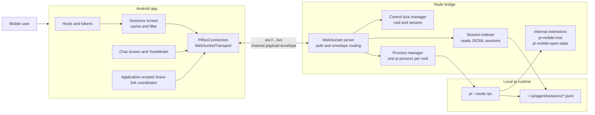
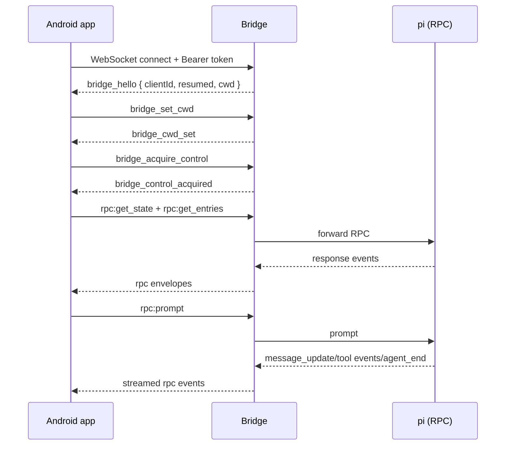
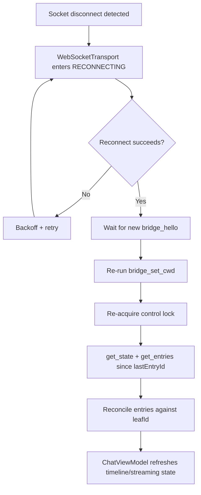
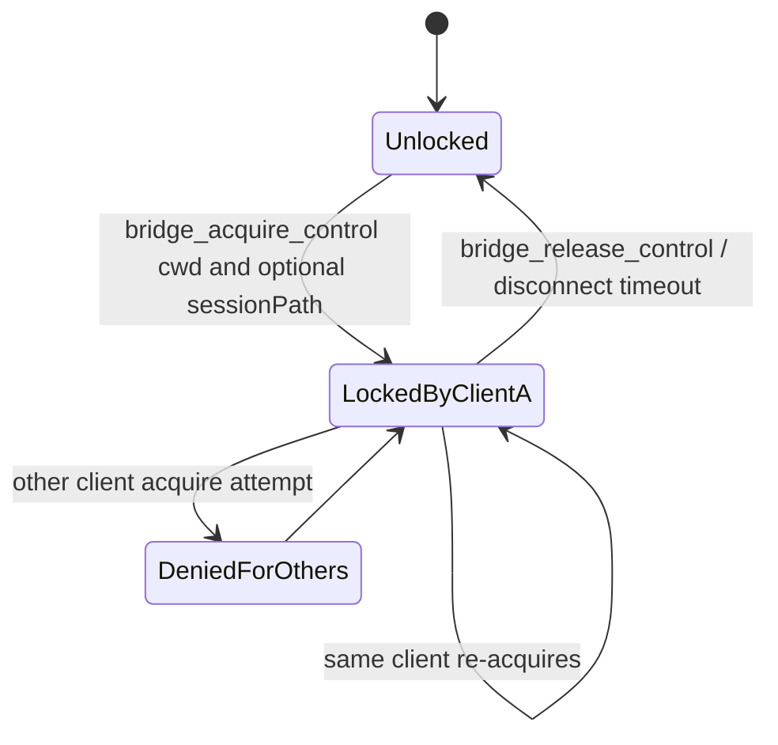

# Pi Mobile Architecture (High-Level)

This document gives a high-level view of how Pi Mobile works across Android, bridge, and pi runtime.

## 1) System Context

## 2) Main Runtime Flow (Resume + Prompt)

## 3) Reconnect + Resync Strategy

## 4) Tree Navigation Bridge Flow

```mermaid
flowchart LR
    A[User selects tree entry] --> B[Android sends bridge_navigate_tree]
    B --> C[Bridge validates cwd + control lock]
    C --> D[Bridge invokes internal pi-mobile-tree command]
    D --> E[Bridge sends rpc prompt: pi-mobile-tree entryId statusKey]
    E --> F[Extension navigates tree + setEditorText + setStatus]
    F --> G[Bridge captures setStatus payload]
    G --> H[Bridge returns bridge_tree_navigation_result]
    H --> I[Android updates tree + editor draft]
```

## 5) Control-Lock Model

## Architectural Notes

- **Bridge is mandatory**: pi RPC is stdio-based; the bridge provides network transport + policy.
- **Per-cwd subprocesses**: isolates project state and keeps tool cwd semantics correct.
- **Control lock before RPC**: prevents concurrent writers to the same cwd/session.
- **Resync after reconnect**: uses durable entry IDs as cursors and performs one explicit full rebuild when the cursor or local projection is invalid.
- **Current tree paths**: active sessions use Pi `get_tree`; bridge-owned filesystem reads remain only for inactive-session browsing. The internal extension remains solely for navigation because Pi 0.80.6 has no navigation RPC command.
- **Freshness monitoring**: bridge-observed mutations push `bridge_session_invalidated` for immediate entry resync. A 60-second foreground-only safety poll covers terminal and other external file edits.
- **Stable identities**: authenticated local state uses `SessionKey(hostProfileId, sessionId)`; external links use only `SharedSessionLocator(authority, version, opaqueReference)`. Pi IDs, local profile IDs, paths, cwd values, tokens, and transcript data never enter external URIs or ordinary logs.
- **Share delivery**: `PiMobileApplication` owns one coordinator across activity recreation. It accepts only `ACTION_VIEW`, consumes each intent once, cancels stale generations, matches only configured endpoint/verified alias authorities, and delegates resolve/resume to the existing controller and locks.
- **Session cockpit**: configured-host caches are observed together and loaded before network refresh. Refresh uses the existing read-only index transports with a two-host concurrency bound; each host retains independent stale/error state. Search projects only sanitized display name/preview/model plus friendly host/workspace labels. Selected cwd and grouped workspace context stay keyed by local host-profile ID, so all-host filtering or cross-host resume cannot combine one host with another host's cwd.
- **Saved sessions and quick reply**: pins/hidden state stores only local `SessionKey` values and density. Hidden items always have an explicit recovery filter, while unresolved saved keys remain generic placeholders. Quick reply delegates resume/control and prompt/follow-up/steer to the existing controller, rejects competing active runs, generation-checks delayed work, and checks the expected active `SessionKey` while holding the controller mutex before dispatch.
- **Retained boundary**: [ADR-0004](adr/ADR-0004-retain-rpc-subprocess-boundary.md) records Android → authenticated bridge → one `pi --mode rpc` process per cwd.
- Decision rationale is captured in [ADRs](adr/README.md).
