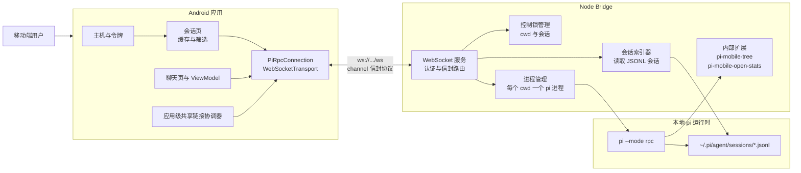
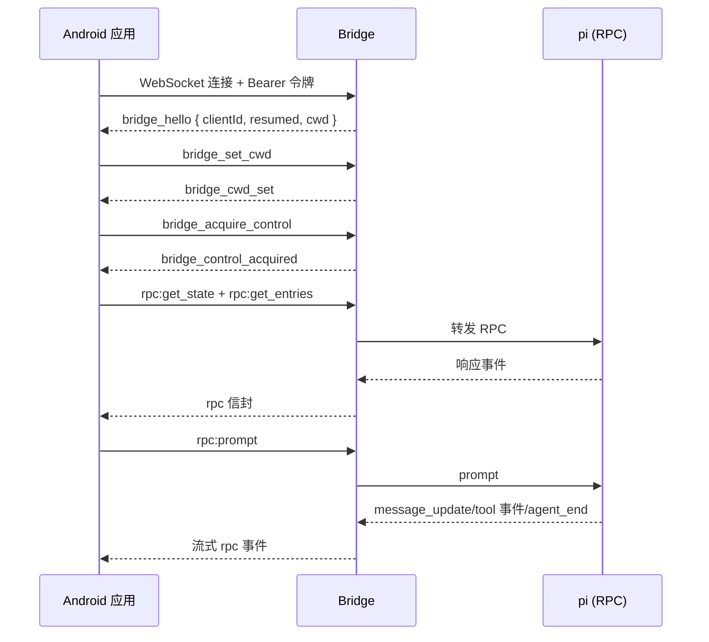
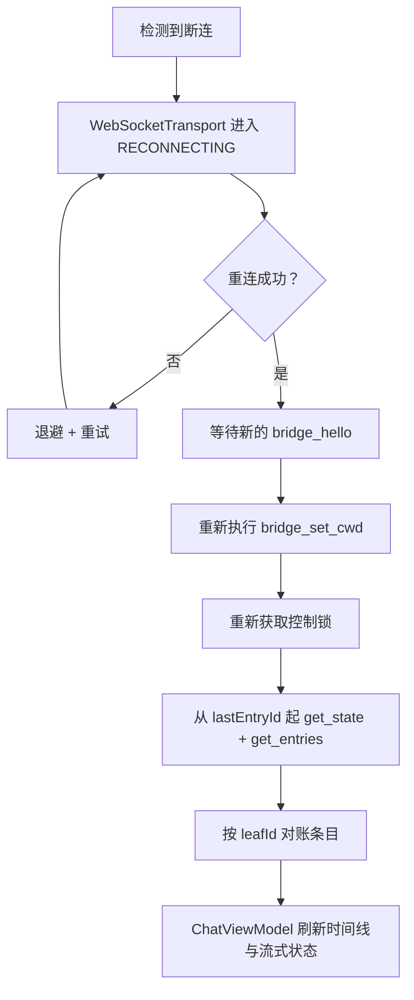
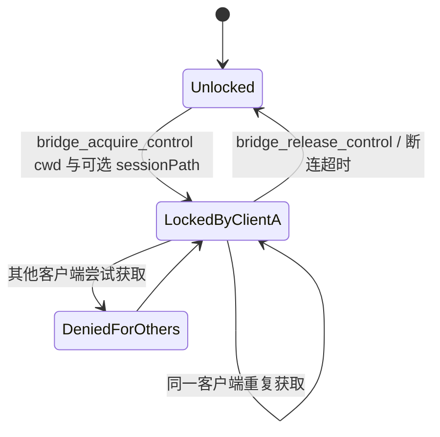

# PiPilot 架构总览

本文从高层视角介绍 PiPilot 在 Android、Bridge 与 pi 运行时之间的工作方式。

## 1) 系统上下文

## 2) 主运行时流程（恢复会话 + 发送提示）

## 3) 重连 + 重新同步策略

## 4) 会话树导航的 Bridge 流程

## 5) 控制锁模型

## 架构要点

- **Bridge 是必需的**：pi RPC 基于 stdio；Bridge 提供网络传输与策略控制。
- **每个 cwd 一个子进程**：隔离项目状态，保证工具的 cwd 语义正确。
- **RPC 前必须持有控制锁**：防止对同一 cwd/会话并发写入。
- **重连后重新同步**：以持久化的条目 ID 为游标；当游标或本地投影无效时执行一次显式全量重建。
- **会话树数据源**：活动会话使用 Pi 的 `get_tree`；Bridge 侧的文件系统读取仅用于非活动会话浏览。内部扩展只负责导航，因为 Pi 0.80.6 没有导航类 RPC 命令。
- **新鲜度监控**：Bridge 观察到会话变更会推送 `bridge_session_invalidated` 触发即时条目重同步；另有仅前台生效的 60 秒兜底轮询，覆盖终端或其他外部编辑。
- **稳定身份**：认证后的本地状态使用 `SessionKey(hostProfileId, sessionId)`；对外链接只使用 `SharedSessionLocator(authority, version, opaqueReference)`。Pi 会话 ID、本地主机 ID、路径、cwd、令牌与对话内容绝不进入外部 URI 或普通日志。
- **共享链接投递**：`PipilotApplication` 持有一个跨 Activity 重建的协调器；只接受 `ACTION_VIEW`，每个 Intent 只消费一次，取消过期代次，只匹配已配置端点/已验证别名的主机，并把解析与恢复委托给既有控制器与锁。
- **会话控制台**：同时观察各已配置主机的缓存，先加载缓存再做网络刷新。刷新复用既有只读索引传输，并发上限两台主机；每台主机保留独立的过期/错误状态。搜索只投影脱敏后的显示名/预览/模型与友好的主机/工作区标签。选中的 cwd 与分组工作区上下文始终以本地主机 ID 为键，因此全主机筛选或跨主机恢复不会把一台主机与另一台主机的 cwd 混搭。
- **已保存会话与快捷回复**：置顶/隐藏状态只保存本地 `SessionKey` 值与展示密度。隐藏项始终有显式的恢复筛选；未能解析的保存键显示为通用占位。快捷回复把恢复/控制与 prompt/追加消息/调整方向委托给既有控制器，拒绝并发的活动运行，对延迟工作做代次检查，并在持有控制器互斥锁时校验期望的活动 `SessionKey` 后才投递。
- **保留的边界**：[ADR-0004](adr/ADR-0004-retain-rpc-subprocess-boundary.md) 记录了「Android → 经过认证的 Bridge → 每个 cwd 一个 `pi --mode rpc` 进程」的边界。
- 决策依据见 [ADR 汇总](adr/README.md)。
